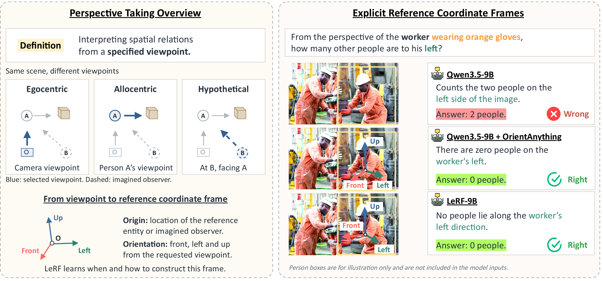
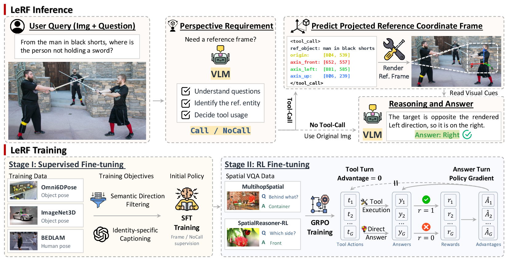

<div align="center">

# LeRF: Learning Reference Coordinate Frames for Perspective Taking Reasoning

**Bang Xiao**<sup>1,2</sup> · **Wenqi Jia**<sup>1</sup> · **Ozgur Kara**<sup>1</sup> · **Tiancheng Shen**<sup>3</sup> ·
**Yibo Yang**<sup>4</sup> 

**Bolin Lai**<sup>1,5,\^</sup> · **Junho Kim**<sup>1,^</sup> · **James Matthew Rehg**<sup>1,\^</sup>

<sup>1</sup>University of Illinois Urbana-Champaign · <sup>2</sup>Zhiyuan College, Shanghai Jiao Tong University 


<sup>3</sup>University of California, Merced · <sup>4</sup>Shanghai Jiao Tong University · <sup>5</sup>Amazon AGI

<sup>\^</sup>Corresponding authors

[🏠 Homepage](https://lerf-project.github.io/) · [🤗 Models](https://huggingface.co/collections/SamuelBang/lerf)

</div>

<p align="center"></p>

Vision-language models (VLMs) struggle with **perspective taking**: when a question asks about
spatial relations from another entity's or an imagined observer's viewpoint, they often fall back
to the camera view. **LeRF** trains a VLM to build and use an explicit **entity-centered reference
frame**. Given an image and a question, the model decides whether a frame is needed. If it is, the
model grounds the reference entity and predicts the frame's projected origin and its **front / left
/ up** axes. A lightweight renderer draws the frame on the image, and the model reasons over this
visual cue. No external perception models or 3D reconstruction are used.

<p align="center"></p>

- **Inference.** Turn 1 (thinking off) produces either a `draw_reference_frame` call (reference
  entity, origin and three axis endpoints in `[0, 1000]` coordinates) or `NO_TOOL_CALL`. Turn 2
  (thinking on) sees the rendered frame instead of the numeric coordinates, reasons over it and
  answers in `\boxed{}`.
- **Stage I: SFT.** The model learns reference-entity grounding and projected frame prediction
  from pose datasets (ImageNet3D, Omni6DPose-SOPE, BEDLAM). About 20% of the data are
  no-tool-call examples that teach selective tool use.
- **Stage II: RL (GRPO).** Trained on MultihopSpatial and SpatialReasoner-RL with a binary
  final-answer reward. The frame-prediction turn is excluded from the policy gradient, so only the
  reasoning and answer turn receives the advantage.

## Results

Accuracy (%) on OmniSpatial perspective taking (OmniSpatial-PT), 3DSRBench (Orientation /
Multi-Object) and ViewSpatial-Bench (person-perspective Object View Orientation / Relative
Direction). **Bold** marks the best open-source result; proprietary models are listed for reference.

| Method | Ego | Allo | Hypo | 3DSR Ori | 3DSR M-Obj | VS P-Obj | VS P-Rel |
|---|:-:|:-:|:-:|:-:|:-:|:-:|:-:|
| *Proprietary* | | | | | | | |
| GPT-5.6-Luna (medium) | 83.33 | 49.73 | 45.78 | 60.04 | 55.34 | 46.99 | 70.07 |
| GPT-5.6-Terra (medium) | 81.37 | 55.85 | 53.01 | 63.32 | 56.39 | 45.08 | 77.20 |
| Claude Sonnet 5 (medium) | 80.39 | 42.55 | 49.40 | 34.94 | 44.77 | 51.31 | 51.43 |
| Claude Sonnet 5 (high) | 84.31 | 48.14 | 45.78 | 43.15 | 46.81 | 51.51 | 60.10 |
| *Open-source* | | | | | | | |
| Qwen3.5-4B | 74.71 | 42.55 | 44.34 | 42.28 | 43.26 | 51.01 | 57.43 |
| Qwen3.5-9B | **80.20** | 47.13 | 44.58 | 48.17 | 48.66 | 56.23 | 65.51 |
| Qwen3.5-9B + APC | 42.16 | 27.66 | 30.12 | 44.98 | 33.22 | 59.34 | 37.53 |
| SpatialReasoner | 40.39 | 35.11 | 35.66 | 52.05 | **50.64** | 42.37 | 45.61 |
| *Ours* | | | | | | | |
| **LeRF-4B** | 72.35 | 49.36 | 46.75 | 45.88 | 44.55 | 56.26 | 67.85 |
| **LeRF-9B** | 74.31 | **54.04** | **55.66** | **53.76** | 50.29 | **61.91** | **74.23** |

LeRF-9B also beats every proprietary model listed on OmniSpatial-PT Hypo and ViewSpatial P-Obj.
See the paper for more baselines, reference-frame estimation accuracy and ablations.

## Repository

LeRF uses Qwen3.5-4B / 9B backbones. SFT (LoRA) was done with LLaMA-Factory. This repository
contains the tool, the inference client and the GRPO training code built on verl.

```
LeRF/
├── tool/                  # the tool and inference-time tool calling
│   ├── frame_tool.py      # renders the frame (pure PIL), argument validation
│   ├── prompts.py         # tool schema, prompts and shared constants
│   ├── system_prompt.txt
│   └── inference.py       # two-turn tool-calling client for a vLLM server
├── verl/                  # verl (commit bf48903d) + our changes, see below
│   ├── lerf/              # agent loop, tool wrapper, reward, data preparation, tests
│   └── examples/lerf/run_grpo.sh
├── assets/                # README figures
└── requirements.txt
```

## Environment

The environment is the standard [verl](https://verl.readthedocs.io/en/latest/start/install.html)
environment (FSDP + vLLM) with a few extras. 

```bash
conda create -n lerf python=3.12 -y && conda activate lerf
pip install vllm==0.24.0            # brings a matching PyTorch; other verl-supported versions may work
pip install flash-attn --no-build-isolation   # or a prebuilt wheel matching your torch / CUDA
pip install -r requirements.txt     # verl requirements + LeRF extras
pip install --no-deps -e verl
pip install causal-conv1d --no-build-isolation   # optional, faster Qwen3.5 linear attention
```

Tested with Python 3.12, CUDA 13.0, PyTorch 2.11, vLLM 0.24.0, transformers 5.10.4 on
NVIDIA RTX PRO 6000 GPUs.

## Inference

Serve the model with vLLM (OpenAI-compatible API), then run the client:

```bash
vllm serve /path/to/LeRF-9B --served-model-name lerf --max-model-len 32768 \
    --limit-mm-per-prompt '{"image": 2}' --trust-remote-code

cd tool
python inference.py --model lerf --image example.jpg \
    --question "From the man's perspective, which object is on his left?" \
    --options cup bed laptop phone --save_renders renders/

# batch: one JSON per line with image / question / options (and optionally answer, id)
python inference.py --model lerf --input questions.jsonl --output results.jsonl
```

Every record stores the full text of each turn (tool call, reasoning and answer), the parsed
tool arguments and the prediction. Defaults follow the training setup: temperature 0.6,
images downscaled to at most 1M pixels, a 10,240-token thinking budget within a 12,288-token
answer turn.

## RL training (GRPO)

1. Prepare data. The input is JSONL with `image`, `question`, `options`, `answer` (index or
   letter) and optionally `id` and `data_source` (one validation curve per `data_source`):

   ```bash
   cd verl
   python -m lerf.prepare_data --train train.jsonl --test test.jsonl --out_dir data/lerf
   ```

2. Train, starting from the tool-calling SFT checkpoint:

   ```bash
   MODEL_PATH=/path/to/sft_ckpt DATA_DIR=data/lerf N_GPUS=4 bash examples/lerf/run_grpo.sh
   ```

   Extra hydra overrides can be appended to the command. The defaults are our training setting
   (Qwen3.5-9B, 4 x 96 GB GPUs, batch 64 x 8 rollouts, lr 1e-6, KL 0.01).

How a rollout works (`lerf/agent/frame_tool_agent_loop.py`):

- turn 1 runs with thinking off and produces one `draw_reference_frame` call or `NO_TOOL_CALL`;
- turn 2 runs with thinking on from a rebuilt context: the tool call keeps only
  `reference_object` and is followed by the rendered image (or, for `NO_TOOL_CALL`, by a
  continuation instruction), so the frame image is the only geometry the model sees;
- each trajectory is stored as two training rows that share one reward; with
  `algorithm.advantage_final_row_only=True` only the answer row receives the GRPO advantage,
  while the tool-call row stays in the KL term;
- the reward (`lerf/reward/reward.py`) is 1 if the response contains exactly one `\boxed{}`
  matching the correct option, else 0.


## Acknowledgements

Built on [verl](https://github.com/verl-project/verl) (Apache-2.0; see `verl/LICENSE`).

## Citation

```bibtex
@misc{xiao2026lerflearningreferencecoordinate,
      title={LeRF: Learning Reference Coordinate Frames for Perspective Taking Reasoning}, 
      author={Bang Xiao and Wenqi Jia and Ozgur Kara and Tiancheng Shen and Yibo Yang and Bolin Lai and Junho Kim and James Matthew Rehg},
      year={2026},
      eprint={2609.36219},
      archivePrefix={arXiv},
      primaryClass={cs.CV},
      url={https://arxiv.org/abs/2609.36219}, 
}
```
